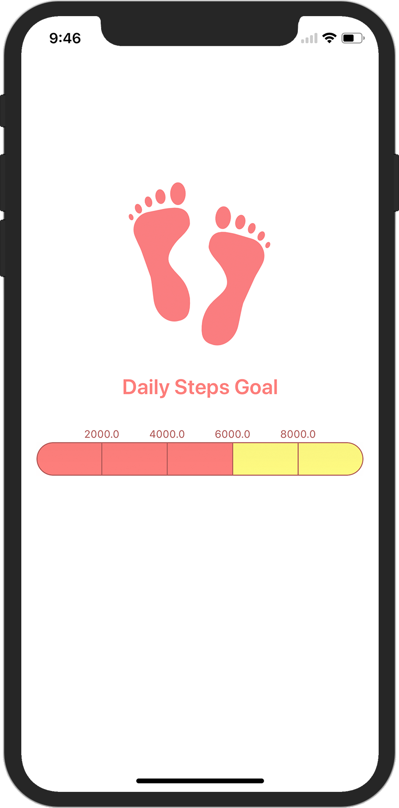
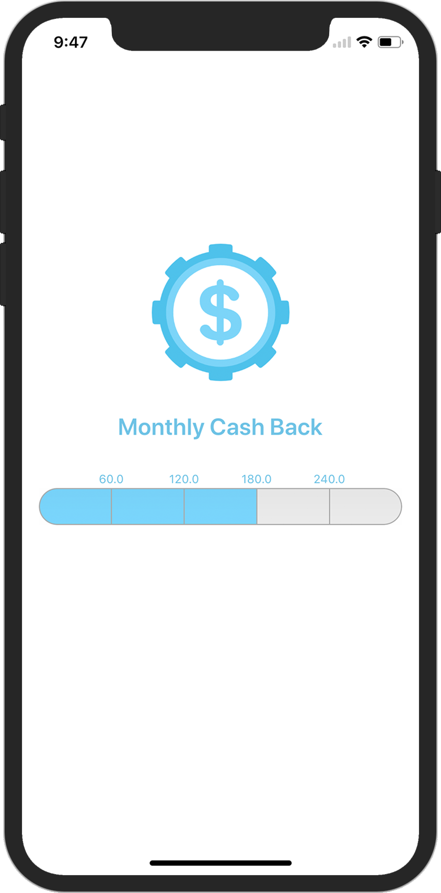
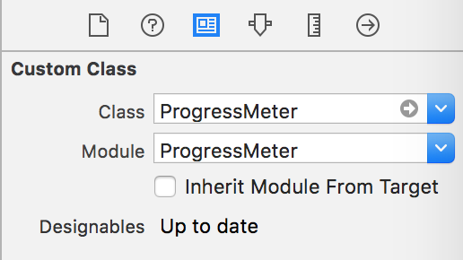
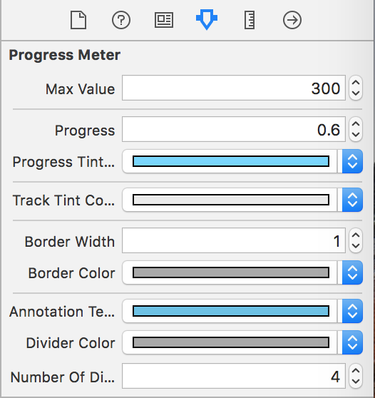

# ProgressMeter 🎰


[](http://cocoapods.org/pods/ProgressMeter)
[](http://cocoapods.org/pods/ProgressMeter)
[](http://cocoapods.org/pods/ProgressMeter)

## Requirements

| Support | Version |
| --- | --- |
| iOS | 9.0 |
| Swift | 4.0 |


## Installation

ProgressMeter is available through [CocoaPods](http://cocoapods.org). To install
it, simply add the following line to your Podfile:

```ruby
pod 'ProgressMeter'
```

## Use Cases

### Health App 🏃‍♂️
<p align="center"></p>


### Banking App 🏦
<p align="center"></p>

## Example

### Interface Builder

Drag & drop a UIView from the object library and follow the steps:

**Step 1**

<p align="center"></p>

**Step 2**

<p align="center"></p>

### Code

Hook your view (ProgressMeter) property on your view controller and try out the snippets inside **viewDidLoad**;

**Snippet # 1:** Looking for setting up the control with your own data 👨‍🏫

```swift
func setupWithCustomData() {
    progressControl.maxValue = 20000
    progressControl.data = [1999, 4999, 9999, 14999]
    progressControl.progress = 14999 / 20000
}
```

**Snippet # 2:** Don't have the data set? ProgressMeter can create its own data 🔢

```swift
func setupWithControlData() {
    progressControl.maxValue = 20000
    progressControl.numberOfDivisions = 4
    progressControl.progress = 0.4
}
```

**Snippet # 3:** Setup the visual aspect 💄
```swift
func visualSetup() {
    progressControl.progressTintColor = .purple
    progressControl.trackTintColor = .gray
    progressControl.borderWidth = 1
    progressControl.borderColor = .darkGray
    progressControl.annotationTextColor = .purple
    progressControl.dividerColor = .darkGray
}
```

## Issues
- [x] Some tweakings required to use ProgressMeter inside a Stack View

## Up Coming Features
- [x] Annotations on bottom; Currenty annotations can only display on the top of ProgressMeter

## Author 🙏🏻
**Web**: [Khawaja Farooq](http://khawajafarooq.github.io)

**Twitter**: [@khfarooq](https://twitter.com/khfarooq)

**Medium**: [@khfarooq](https://medium.com/@khfarooq)


## License

ProgressMeter is available under the MIT license. See the LICENSE file for more info.
